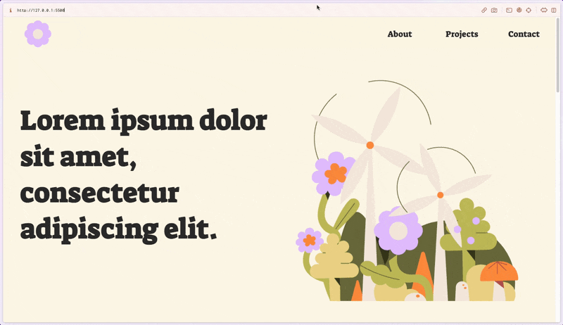

# Header animé

Un header animé avec Lottie. Quand on scroll le menu change de couleur de fond.

## Ressources

[➜ Illustration : drawkit](https://www.drawkit.com/)

[➜ Lottie](https://lottiefiles.com/)

[➜ Generateur de grille : css grid generator](https://cssgrid-generator.netlify.app/)

[➜ Plugin Figma pour animer : Aninix](https://www.aninix.com/)

[➜ Typo : Suez One](https://fonts.google.com/specimen/Suez+One?query=Suez)

[➜ référence : Header Design Websites](https://www.awwwards.com/websites/header-design/)

## Demo

